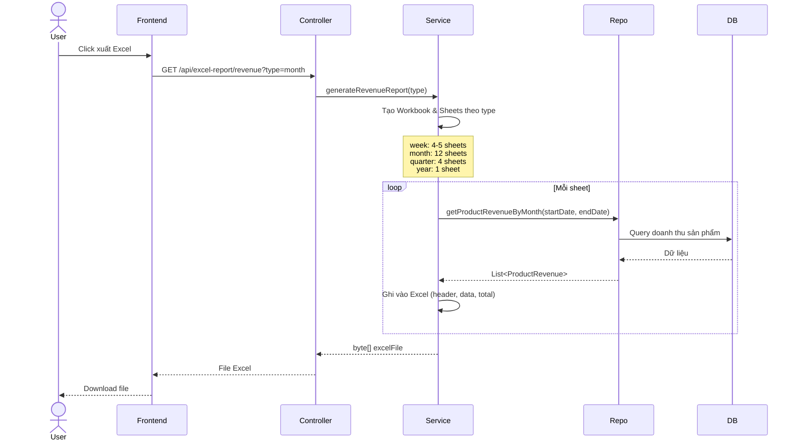

# Sơ Đồ Sequence - Xuất Excel



## Query Database
```sql
SELECT p.name, c.name, SUM(od.quantity), SUM(od.sub_total)
FROM orders o
JOIN order_detail od ON o.id = od.order_id
JOIN product p ON od.product_id = p.id
JOIN category c ON p.category_id = c.id
WHERE o.order_status IN ('PAID', 'SHIPPING', 'COMPLETED')
  AND o.pay_datetime BETWEEN :startDate AND :endDate
GROUP BY p.id
ORDER BY totalRevenue DESC
```

## Cấu trúc Excel
```
DOANH THU THÁNG 11/2024
Ngày xuất: 28/11/2024
─────────────────────────────────
STT | Tên | Danh mục | SL | Tiền
─────────────────────────────────
 1  | ... |   ...    | 50 | 500k₫
 2  | ... |   ...    | 30 | 300k₫
─────────────────────────────────
        TỔNG CỘNG     | 80 | 800k₫
```

